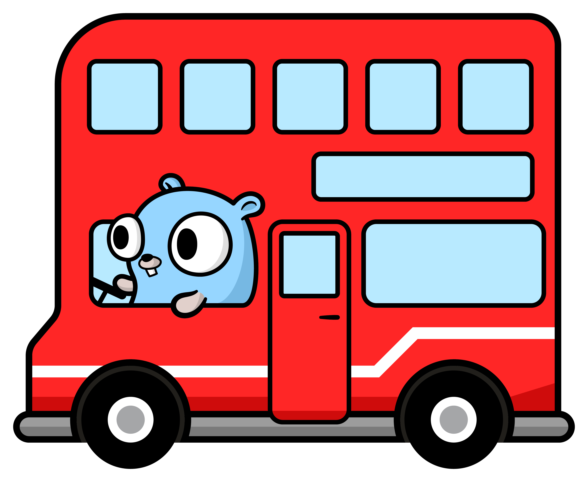

# Banter Bus

Banter Bus is a web application video game, inspired by other party games like JackBox.


## Usage

To set up the app you can do:

### Nix Flakes (Preferred)

If you use Nix flakes and direnv setup you can simply do:

```bash
git clone https://gitlab.com/hmajid2301/banterbus
cd banterbus
direnv allow

# Launch the app
task dev
```

## Stack

This app is using the following technologies, built using this [template](https://gitlab.com/hmajid2301/nix-go-htmx-tailwind-template).

More [information here](https://gitlab.com/hmajid2301/nix-go-htmx-tailwind-template#features)

### Backend

- Go
    - Standard Library HTTP Server
    - Websockets for communication
- templ as the templating engine
- Postgres DB
- Redis (Pub Sub)

### Frontend

- htmx
  - For avoiding writing JS
- alpinejs
  - For interactivity again to avoid writing JS
- Tailwind CSS

### DevEx

- Nix for reproducibility
    - gomod2nix to build go binary with Nix
    - Development Shells
    - Pre Commit Hooks
    - Build Docker images
        - CI Image
        - Service
- Gitlab for CI/CD pipeline
- Taskfiles as the task runner
