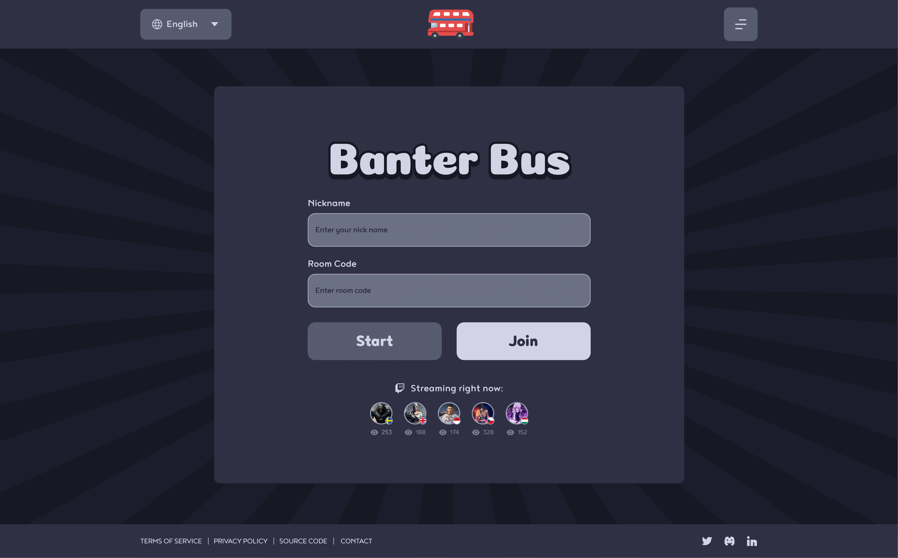

# Banter Bus

Banter Bus is a multiplayer web-based party game inspired by JackBox games. Players join lobbies to play social deduction and guessing games together in real-time.



## Table of Contents

- [Getting Started](#getting-started)
- [Technology Stack](#technology-stack)
- [Development Setup](#development-setup)
- [CI/CD Configuration](#cicd-configuration)
- [Available Commands](#available-commands)

## Getting Started

## Quick Start with Nix

```bash
# Clone the repository
git clone https://gitlab.com/hmajid2301/banterbus
cd banterbus

# Allow direnv to load the development environment
direnv allow

# Start the development server
task dev
```

The application will be available at `http://localhost:8080`.

## Development Setup

### Environment Configuration

Set up your environment variables for local development:

Key environment variables:
- `BANTERBUS_DB_URI` - PostgreSQL connection string
- `BANTERBUS_REDIS_ADDRESS` - Redis server address
- `BANTERBUS_WEBSERVER_PORT` - Application port (default: 8080)
- `BANTERBUS_LOG_LEVEL` - Logging level (DEBUG, INFO, WARN, ERROR)

### Preview Environments

When creating merge requests, you can deploy preview environments:

1. Add the `deploy/flux-preview` label to your merge request
2. CI will automatically build and deploy a preview environment
3. Access your preview at `https://mr-{MR_ID}.dev.banterbus.games`
4. Environment is automatically cleaned up when MR is merged/closed

## CI/CD Configuration

### Required GitLab CI/CD Variables

Configure these in GitLab Project Settings → CI/CD → Variables:

- `GITLAB_ACCESS_TOKEN` - Personal access token for Terraform state management
- `GITLAB_REMOTE_STATE_ADDRESS` - Remote state URL: `https://gitlab.com/api/v4/projects/PROJECT_ID/terraform/state/banterbus`
- `GITLAB_USERNAME` - GitLab username for authentication

- `CLOUDFLARE_API_TOKEN` - API token for DNS management
- `CLOUDFLARE_ZONE_ID` - Zone ID for banterbus.games domain

- `POSTGRES_HOST` - PostgreSQL host
- `POSTGRES_USERNAME` - PostgreSQL username
- `POSTGRES_PASSWORD` - PostgreSQL password (mark as protected/masked)
- `OPENBAO_ADDRESS` - OpenBao vault address
- `OPENBAO_TOKEN` - OpenBao authentication token (mark as protected/masked)
- `GRAFANA_SERVICE_ACCOUNT_TOKEN` - Grafana service account token (mark as protected/masked)

- `TAILSCALE_AUTH_KEY` - Faster Nix builds via Tailscale network
- `ATTIC_AUTH_KEY` - Binary cache for faster Nix operations

## Technology Stack

### Backend
- **Go** - Core application language
  - Standard library HTTP server
  - gobwas/ws for WebSocket communication
  - SQLC for type-safe database queries
- **PostgreSQL** - Primary database for game state and user data
- **Redis** - Pub/Sub messaging for real-time events between players
- **templ** - Type-safe HTML templating

### Frontend

- **HTMX** - Dynamic HTML updates without JavaScript frameworks
- **Alpine.js** - Minimal JavaScript for interactive components
- **Tailwind CSS** - Utility-first styling

### Development Experience

- **Nix** - Reproducible development environments
  - gomod2nix for Go dependency management
  - Automated development shells
  - Pre-commit hooks for code quality
  - Docker image builds
- **Task** - Simple task runner (alternative to Make)
- **Air** - Live reload during development
- **SQLC** - Generate type-safe Go code from SQL

### Infrastructure & Deployment

- **Terraform** - Infrastructure as code
  - Single state file with workspace separation (dev/prod)
  - Automated DNS management via Cloudflare
  - Secret management through OpenBao
- **Kubernetes** - Container orchestration
  - GitOps deployment with Flux CD
  - Automatic scaling and health checks
- **GitLab CI/CD** - Continuous integration and deployment
  - Automated testing (unit, integration, e2e)
  - Docker image builds and registry management
  - **Preview Environments** - Automatic deployment for merge requests
    - Temporary environments for testing features
    - Automatic cleanup when MR is closed
    - URL format: `https://mr-{ID}.dev.banterbus.games`

### Monitoring & Observability

- **OpenTelemetry** - Distributed tracing and metrics
- **Grafana** - Metrics visualization and alerting
- **Prometheus** - Metrics collection and storage
- **Loki** - Log aggregation
- **Tempo** - Distributed tracing backend
