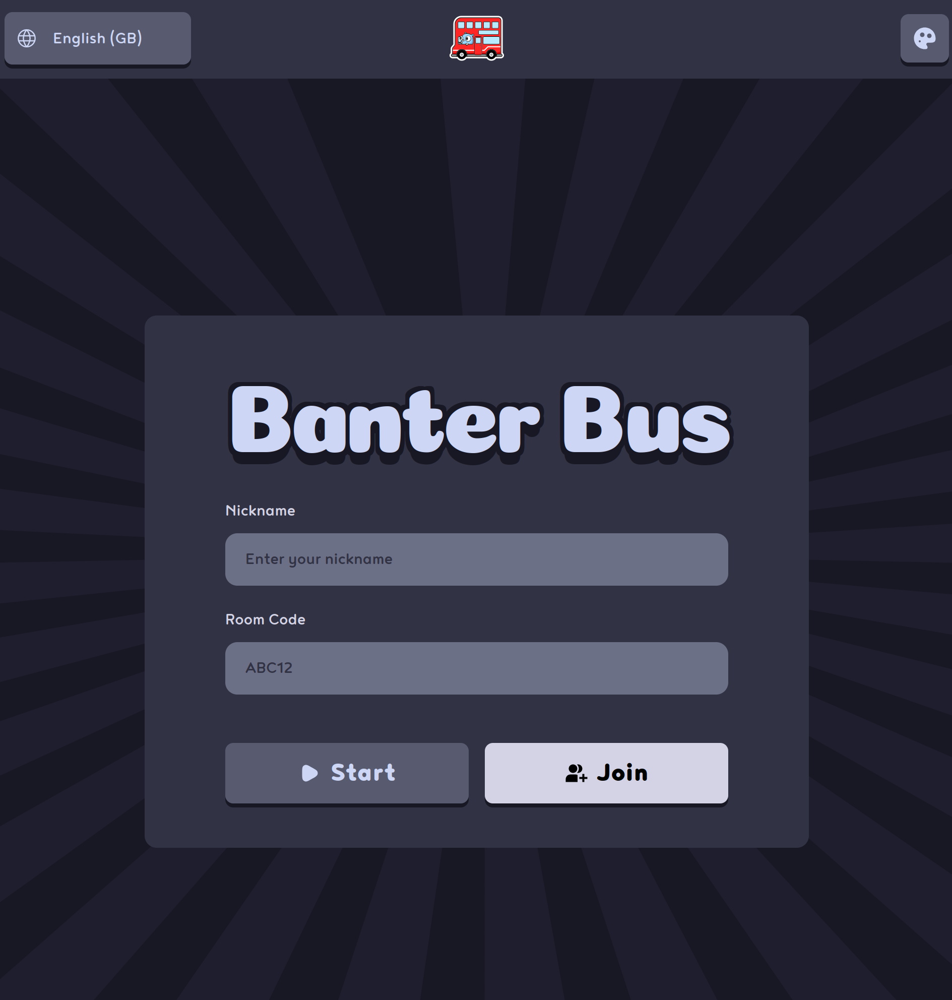

# Banter Bus

Banter Bus is a web application video game, inspired by other party games like JackBox.



## Usage

To set up the app you can do:

### Nix Flakes (Preferred)

If you use Nix flakes and direnv setup you can simply do:

```bash
git clone https://gitlab.com/banterbus/banterbus
cd banterbus
direnv allow

# Launch the app
task dev
```

## Stack

This app is using the following stack

### Backend

- Go
    - Standard Library HTTP Server
    - Websockets for communication
- templ as the templating engine
- Postgres DB
- Redis (Pub Sub)

### Frontend

- htmx
  - For avoiding writing JS
- alpinejs
  - For interactivity again to avoid writing JS
- Tailwind CSS

### DevEx

- Nix for reproducibility
    - gomod2nix to build go binary with Nix
    - Development Shells
    - Pre Commit Hooks
    - Build Docker images
        - CI Image
        - Service
- Gitlab for CI/CD pipeline
    - Enhanced with Tailscale and Attic for faster Nix builds
    - Requires `TAILSCALE_AUTH_KEY` and `ATTIC_AUTH_KEY` environment variables
    - Falls back gracefully when environment variables are not available
- Taskfiles as the task runner

### Infra

- Terraform/OpenTofu for infrastructure management
    - Automated tunnel hostname generation from OpenBao
    - Cloudflare DNS record management
    - Database and secret management
- K8S
    - GitOps w/ Flux
      - Main repo: https://gitlab.com/banterbus/k8s-gitops)
    - BanterBus specific code
